## Kenzie Empresas / isgabriel

A Kenzie Empresas é um site para contratação de candidatos em diferentes setores da empresa. Ao criar sua conta, o usuário é cadastrado no banco de dados para futuras contratações da empresa. Ao fazer login o candidato consegue acompanhar sua situação na empresa e, caso ele seja contratado, poderá ver seus colegas do setor que também irão acompanhá-lo no dia a dia, além de conseguir editar seu perfil. O sistema possui um login único para o diretor da empresa acessar e realizar manutenções. O diretor consegue criar novos setores, excluir setores, contratar candidatos cadastrados que ainda não possuem um cargo e demitir funcionários.

## Tecnologias
Aqui estão as tecnologias usadas nesse projeto.
 - HTML
 - CSS (mobile first)
 - Javascript
 
 ## Serviço usado
 - Github
 
 ## Como usar
 <h3>1 - Instale a API localmente na sua máquina (visite a seção de Instalação da API)</h3>
 
 <h3>2 - Ao acessar a página, você verá a página inicial <3</h3>
 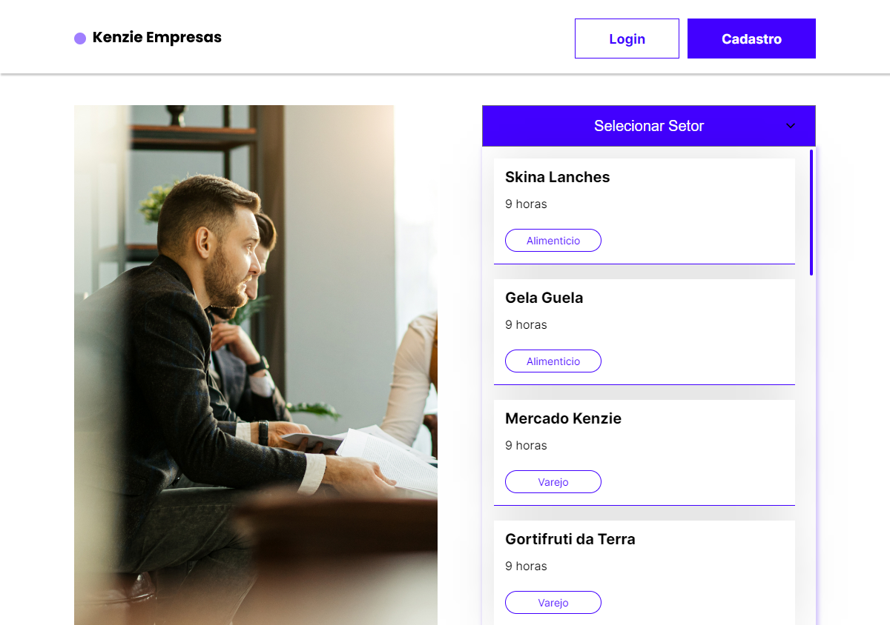
 
 <h3>3 - Caso ainda não tenha uma conta cadastrada, você pode acessar nossa página de cadastro</h3>
 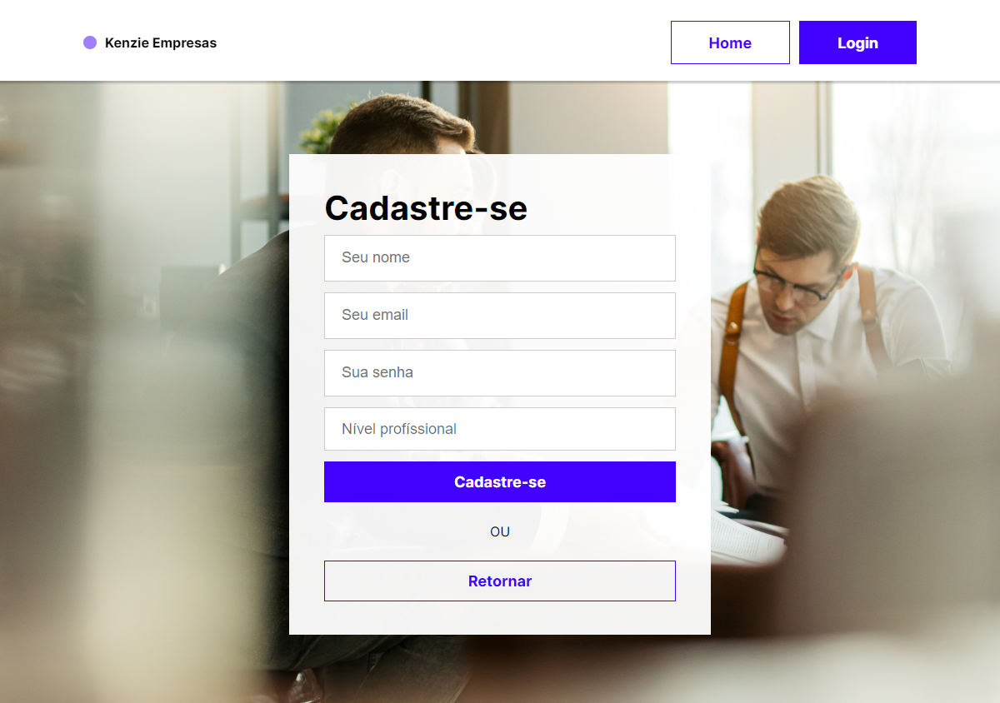
 
 <h3>4 - Após cadastrar sua conta você poderá fazer login :)</h3>
 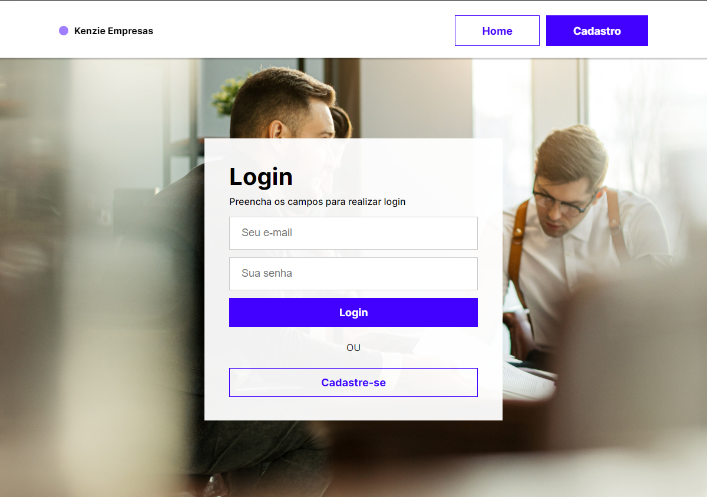
 
 <h3>5 - Ao validar suas informações de Login, você terá acesso a Dashboard</h3>
 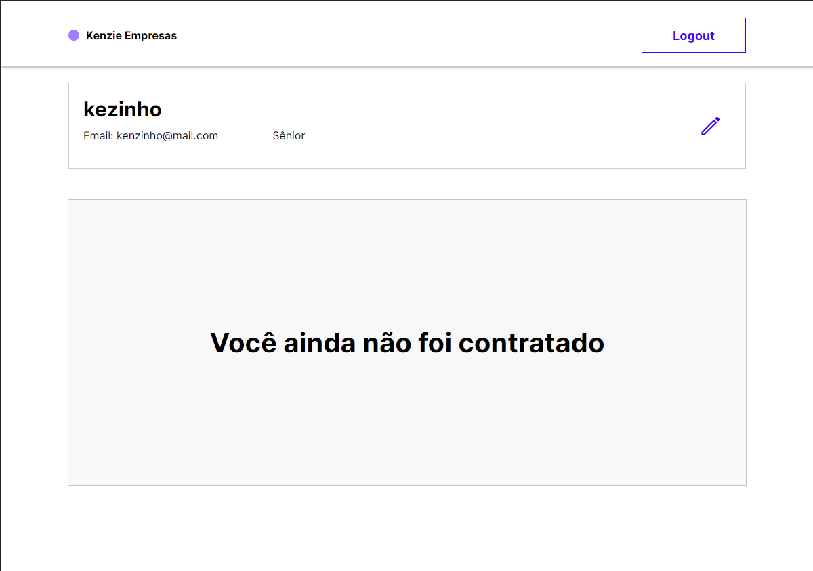
 
 <h3>6 - Você também pode editar seus dados!</h3>
 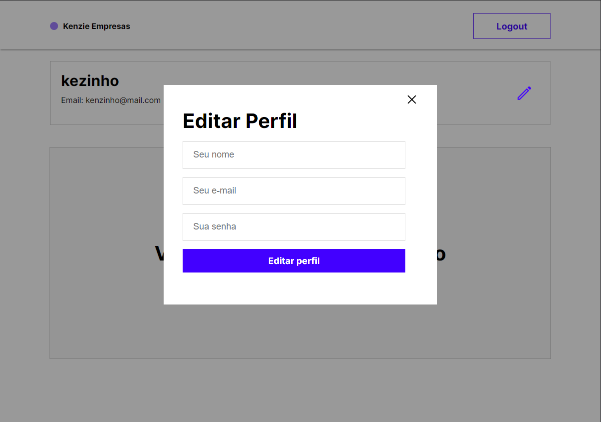

 <h3>7 - O diretor da empresa possui a Dashboard com funcionalidades adicionais</h3>
 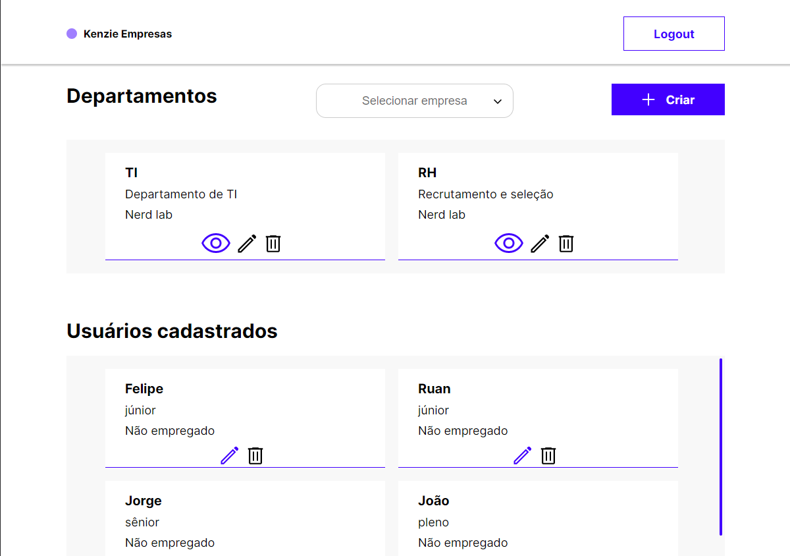
 
  <h3>8 - É possível criar um novo Departamento</h3>
  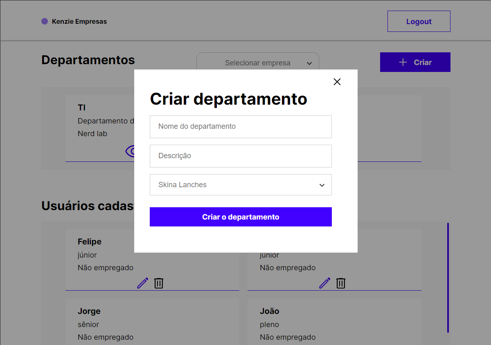

 <h3>9 - Os Departamentos podem sofrer alterações!</h3>
    <h4>Contratar novos funcionários</h4>
    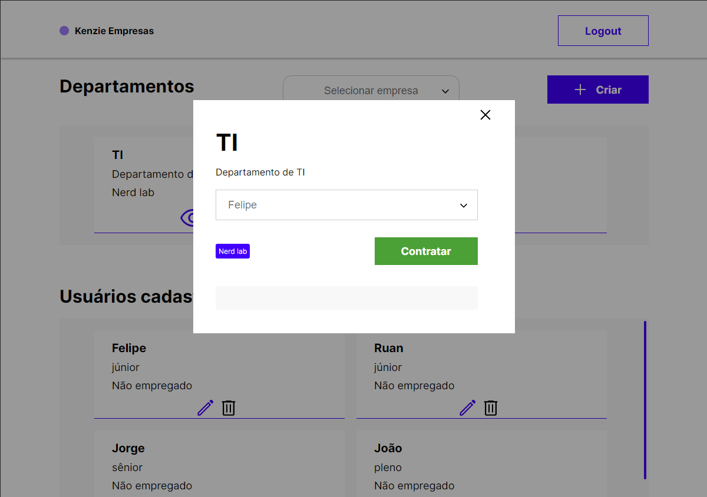
    <h4>Editar nome do Departamento</h4>
    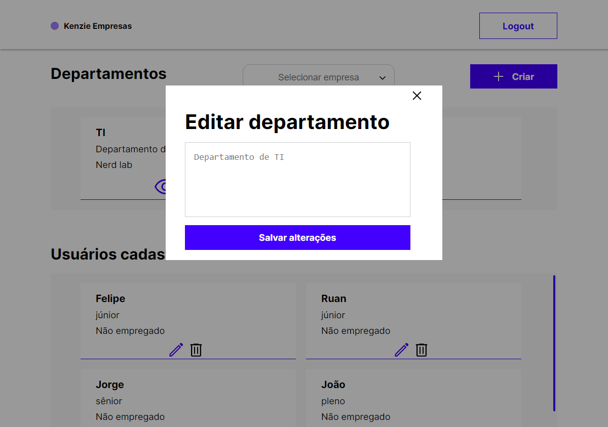
    <h4>Deletar Departamento</h4>
    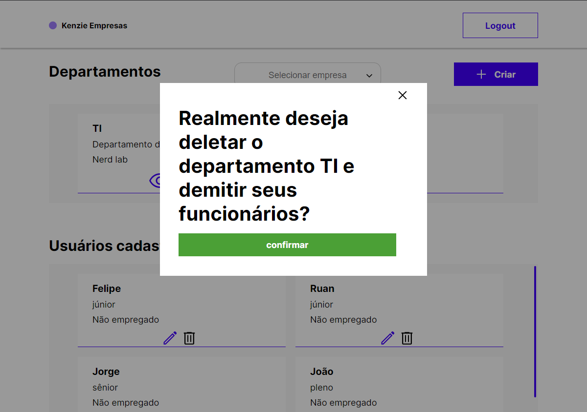

 <h3>10 - Os usuários também podem sofrer alterações como mudança na modalidade de trabalho ou de nível profissional</h3>
 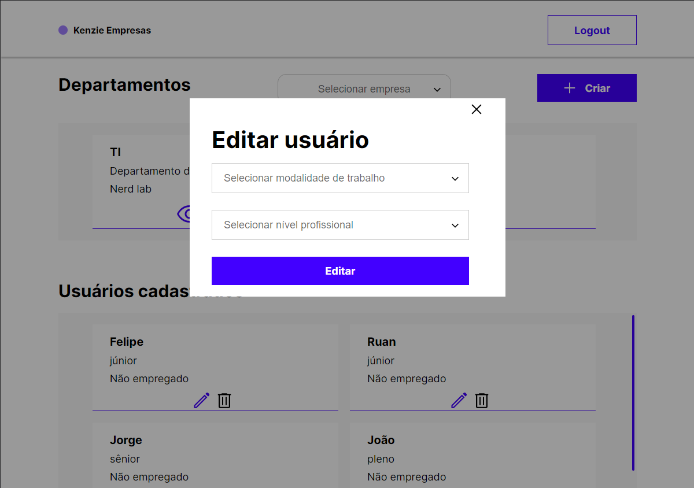

 <h3>11 - Também é possível deletar um candidato da plataforma :(</h3>
 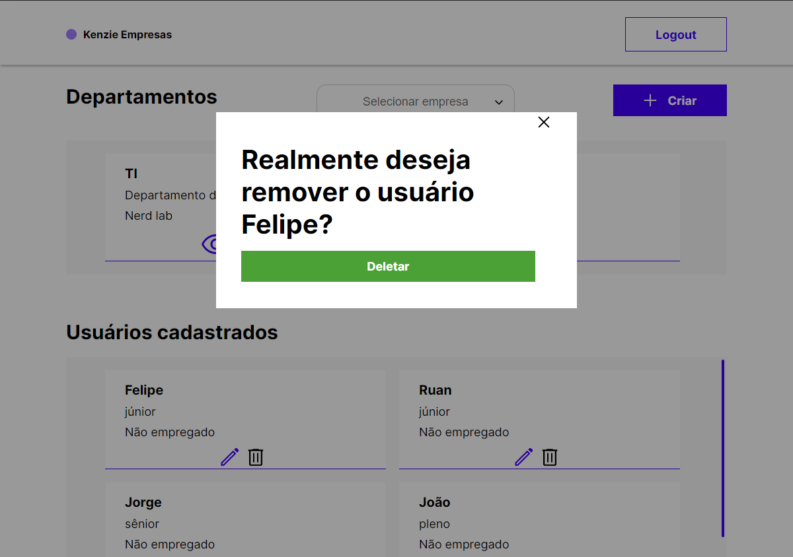

 
 ## Instalação da API
 - Clone o repositório da API (<a href="https://github.com/Jardel-Kenzie/m2-api-empresas">Clique aqui</a>).
 - Rode os seguintes comandos no terminal dentro da pasta da API: 
   - npm install
   - npm run start
   - npm run build
   - npm run dev
 - Caso tudo dê certo, aparecerá no terminal a seguinte mensagem: "App is running".
 
 ## Funcionalidades
 As principais funcionalidades da aplicação são:
 - Fazer o cadastro.
 - Fazer o login.
 - Editar informações de usuário.
 - Contratar e demitir funcionários.
 - Criar, alterar ou deletar setores.
 - Alterar modalidade de trabalho e nível profissionais dos usuários cadastrados.
 - Deletar usuários da plataforma.
 
 ## Links
 - Deploy: https://kenzie-empresas-rho.vercel.app
 - Repository: https://github.com/isgabriel/Kenzie-Empresas
 
 ## Autores
 - <strong>Gabriel Fragoso Montenegro</strong>
 
Por favor, siga o github e junte-se a nós! Obrigado pela visita! <3

 
